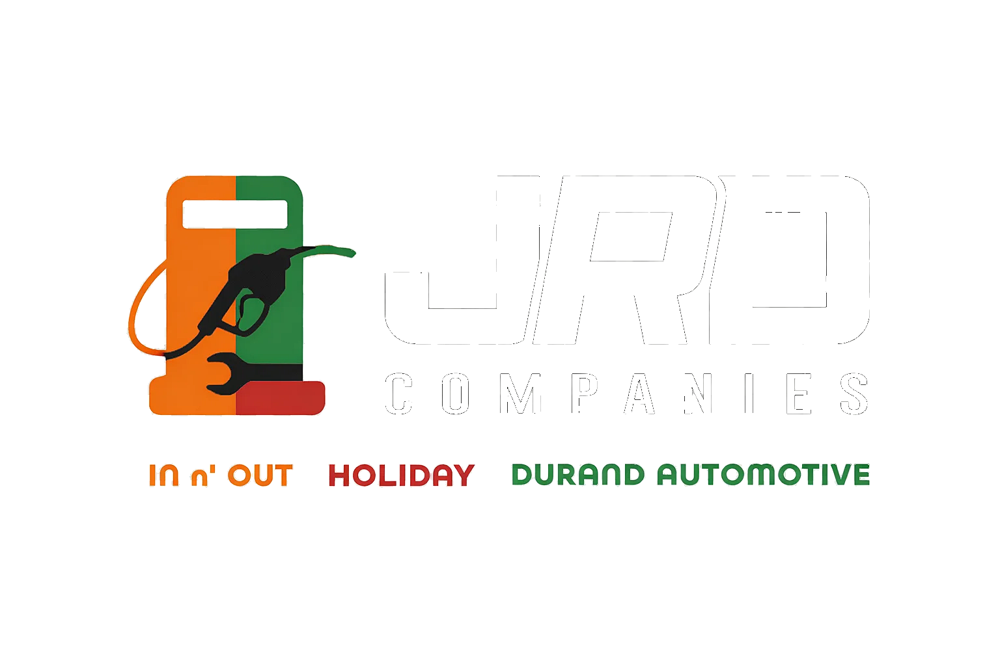
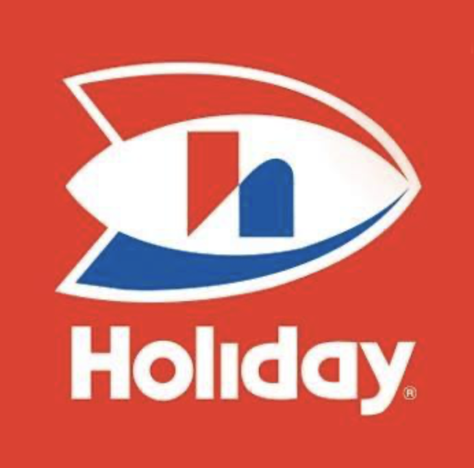
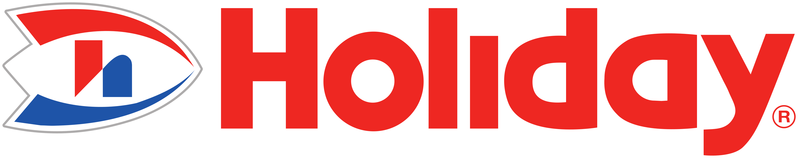

# jrdcompanies.com
2026 JRD Companies Website 

<!doctype html>
<html lang="en">
<head>
  <meta charset="utf-8" />
  <meta name="viewport" content="width=device-width,initial-scale=1" />
  <title>JRD Companies | Minnesota Fuel, Convenience & Auto Service</title>
  <meta name="description" content="JRD Companies operates Minnesota fuel stations, convenience stores, and Durand Automotive. Local ownership, clean stores, fair pricing, and honest service." />

  <!-- Open Graph -->
  <meta property="og:title" content="JRD Companies | Minnesota Fuel, Convenience & Auto Service" />
  <meta property="og:description" content="Fuel stations, convenience stores, and auto service you can trust across Minnesota." />
  <meta property="og:type" content="website" />

  <!-- Fonts -->
  <link rel="preconnect" href="https://fonts.googleapis.com">
  <link rel="preconnect" href="https://fonts.gstatic.com" crossorigin>
  <link href="https://fonts.googleapis.com/css2?family=Oswald:wght@400;500;600;700&family=Roboto:wght@300;400;500;700&family=JetBrains+Mono:wght@400;500;600&display=swap" rel="stylesheet">

  
</head>

<body>

  <!-- Password Gate -->
  

    

      

        
        
JRD Companies

        
Enter password to continue

      

      
Incorrect password

      <input type="password" id="gatePassword" placeholder="Enter Password" autocomplete="current-password" autofocus>
      <button class="gate-btn" id="gateBtn" type="button">Enter Site</button>

      

        Protected access
      

    

  

  

    <!-- Header -->
    <header>
      

        

          <nav class="nav" aria-label="Primary Navigation">
            

              <a class="nav-link" href="#home">Home</a>
              <a class="nav-link" href="#businesses">Businesses</a>
              <a class="nav-link" href="#why">Why JRD</a>
            

            

              <a href="#home" aria-label="JRD Companies Home">
                
                

                  <small style="font-size:.82rem;letter-spacing:2.5px;">Fuel &bull; Convenience &bull; Auto Service</small>
                

              </a>
            

            

              <a class="nav-link" href="#contact">Contact</a>
              <a class="nav-cta" href="#businesses">Find a Location</a>
              <a class="nav-cta portal" href="/portal/">Portal</a>
            

            <button class="menu-btn" type="button" aria-label="Menu" onclick="toggleMobileMenu()">&#9776;</button>
          </nav>

          

            <a href="#home" onclick="closeMobileMenu()">Home</a>
            <a href="#businesses" onclick="closeMobileMenu()">Businesses</a>
            <a href="#why" onclick="closeMobileMenu()">Why JRD</a>
            <a href="#contact" onclick="closeMobileMenu()">Contact</a>
            <a href="/portal/" onclick="closeMobileMenu()">Portal</a>
          

        

      

    </header>

    <!-- Hero -->
    <main id="home">
      <section class="hero">
        

          

            

              
 Minnesota-owned operations &bull; Fuel + Auto

              <h1>Fuel. Convenience. Auto Service.</h1>
              

                Hard-working stations and a no-BS auto shop across Minnesota.
                Clean stores. Fair prices. Honest repairs. Built for the communities we serve.
              

              

                <a class="btn btn-primary" href="#businesses">Explore Locations</a>
                <a class="btn btn-green" href="/portal/">Employee Portal</a>
                <a class="btn btn-ghost" href="#contact">Request Info</a>
              

              

                
                  <svg viewBox="0 0 24 24" fill="none" stroke="currentColor" stroke-width="2">
                    <path d="M22 16.92v3a2 2 0 0 1-2.18 2 19.79 19.79 0 0 1-8.63-3.07 19.5 19.5 0 0 1-6-6 19.79 19.79 0 0 1-3.07-8.67A2 2 0 0 1 4.11 2h3a2 2 0 0 1 2 1.72 12.84 12.84 0 0 0 .7 2.81 2 2 0 0 1-.45 2.11L8.09 9.91a16 16 0 0 0 6 6l1.27-1.27a2 2 0 0 1 2.11-.45 12.84 12.84 0 0 0 2.81.7A2 2 0 0 1 22 16.92z"/>
                  </svg>
                  <a href="tel:+16517394940">(651) 739-4940</a>
                

                
                  <svg viewBox="0 0 24 24" fill="none" stroke="currentColor" stroke-width="2">
                    <path d="M4 4h16v16H4z"/><path d="M22 6l-10 7L2 6"/>
                  </svg>
                  <a href="mailto:info@jrdcompanies.com">info@jrdcompanies.com</a>
                

                
                  <svg viewBox="0 0 24 24" fill="none" stroke="currentColor" stroke-width="2">
                    <path d="M12 21s-7-4.5-7-11a7 7 0 1 1 14 0c0 6.5-7 11-7 11z"/>
                    <circle cx="12" cy="10" r="2.5"/>
                  </svg>
                  Twin Cities Metro + Surrounding
                
              

            

            

              

                
              

              

                
              

              

                
              

              

                
                

                  <strong>Fuel + Auto</strong> 
                  One operator. Multiple brands.
                

              

            

          

          

            

              

                
                  <svg viewBox="0 0 24 24" fill="none" stroke="currentColor" stroke-width="2">
                    <path d="M6 21V7a2 2 0 0 1 2-2h8a2 2 0 0 1 2 2v14"/>
                    <path d="M9 21v-4a1 1 0 0 1 1-1h4a1 1 0 0 1 1 1v4"/>
                    <path d="M10 9h4M10 12h4"/>
                  </svg>
                
                
<strong>Clean Stores</strong>
Convenience done right

              

              

                
                  <svg viewBox="0 0 24 24" fill="none" stroke="currentColor" stroke-width="2">
                    <path d="M12 2v7"/><path d="M8.5 6.5 12 9l3.5-2.5"/>
                    <path d="M7 9h10l-1 13H8L7 9z"/>
                  </svg>
                
                
<strong>24/7 Fuel</strong>
Always on, always ready

              

              

                
                  <svg viewBox="0 0 24 24" fill="none" stroke="currentColor" stroke-width="2">
                    <path d="M14.7 6.3a1 1 0 0 0 0 1.4l1.6 1.6a1 1 0 0 0 1.4 0l3.77-3.77a6 6 0 0 1-7.94 7.94l-6.91 6.91a2.12 2.12 0 0 1-3-3l6.91-6.91a6 6 0 0 1 7.94-7.94l-3.76 3.76z"/>
                  </svg>
                
                
<strong>Honest Repairs</strong>
Diagnostics &rarr; fix it right

              

              

                
                  <svg viewBox="0 0 24 24" fill="none" stroke="currentColor" stroke-width="2">
                    <path d="M12 21s-8-4-8-11a8 8 0 1 1 16 0c0 7-8 11-8 11z"/>
                    <path d="M9.5 10.5 11 12l3.5-3.5"/>
                  </svg>
                
                
<strong>Local Ownership</strong>
Community-first mindset

              

            

          

        

      </section>

      <!-- Ticker -->
      <section class="ticker" aria-label="Energy & Market Ticker">
        

          

            

          

        

      </section>

      <!-- About -->
      <section class="section about" id="about">
        

          

            <h2 class="section-title">Built for Minnesota</h2>
            

          

          

            

              

                

                  <strong>JRD Companies</strong> operates fuel stations, convenience retail, and a full-service automotive shop.
                  The mission is simple: run clean locations, staff strong teams, and do business the right way.
                

                

                  Whether you're fueling up, grabbing essentials, or getting your vehicle repaired,
                  you should get straight answers, fair pricing, and service that respects your time.
                

                

                  No gimmicks. No excuses. Just reliable operations.
                

                

                  

                    
3

                    
Core locations

                  

                  

                    
15+

                    
Years operating

                  

                  

                    
24/7

                    
Fuel access

                  

                

              

            

            

              
              
Ops Status <b>LIVE</b>

            

          

        

      </section>

      <!-- Businesses -->
      <section class="section" id="businesses">
        

          

            <h2 class="section-title">Our Businesses</h2>
            

          

          

            <!-- Holiday -->
            <a class="biz-card" href="/holiday.html" aria-label="Holiday Stationstores - Lakeville">
              

                
                

                  

                    <h3>Holiday Stationstores</h3>
                    
Store #3851 &bull; Lakeville

                  

                  

                    
                    Live &bull; Fuel
                  

                

              

              

                

                  

                    <svg viewBox="0 0 24 24" fill="none" stroke="currentColor" stroke-width="2">
                      <path d="M21 10c0 7-9 13-9 13s-9-6-9-13a9 9 0 0 1 18 0z"/><circle cx="12" cy="10" r="3"/>
                    </svg>
                    

                      <strong>Address</strong>
                      16255 Ipava Ave, Lakeville, MN 55044
                    

                  

                  

                    <svg viewBox="0 0 24 24" fill="none" stroke="currentColor" stroke-width="2">
                      <path d="M22 16.92v3a2 2 0 0 1-2.18 2 19.79 19.79 0 0 1-8.63-3.07 19.5 19.5 0 0 1-6-6 19.79 19.79 0 0 1-3.07-8.67A2 2 0 0 1 4.11 2h3a2 2 0 0 1 2 1.72 12.84 12.84 0 0 0 .7 2.81 2 2 0 0 1-.45 2.11L8.09 9.91a16 16 0 0 0 6 6l1.27-1.27a2 2 0 0 1 2.11-.45 12.84 12.84 0 0 0 2.81.7A2 2 0 0 1 22 16.92z"/>
                    </svg>
                    

                      <strong>Phone</strong>
                      (952) 435-7827
                    

                  

                

                

                  Fuel
                  C-Store
                  24/7
                  ATM
                

                

                  View Prices
                  Store Details
                

              

            </a>

            <!-- IN N OUT -->
            <a class="biz-card" href="/innout.html" aria-label="IN N OUT - Maplewood">
              

                
                

                  

                    <h3>IN N OUT</h3>
                    
Minnoco Fuel &bull; Maplewood

                  

                  

                    
                    Live &bull; Fuel
                  

                

              

              

                

                  

                    <svg viewBox="0 0 24 24" fill="none" stroke="currentColor" stroke-width="2">
                      <path d="M21 10c0 7-9 13-9 13s-9-6-9-13a9 9 0 0 1 18 0z"/><circle cx="12" cy="10" r="3"/>
                    </svg>
                    

                      <strong>Address</strong>
                      1935 English St, Maplewood, MN 55109
                    

                  

                  

                    <svg viewBox="0 0 24 24" fill="none" stroke="currentColor" stroke-width="2">
                      <path d="M22 16.92v3a2 2 0 0 1-2.18 2 19.79 19.79 0 0 1-8.63-3.07 19.5 19.5 0 0 1-6-6 19.79 19.79 0 0 1-3.07-8.67A2 2 0 0 1 4.11 2h3a2 2 0 0 1 2 1.72 12.84 12.84 0 0 0 .7 2.81 2 2 0 0 1-.45 2.11L8.09 9.91a16 16 0 0 0 6 6l1.27-1.27a2 2 0 0 1 2.11-.45 12.84 12.84 0 0 0 2.81.7A2 2 0 0 1 22 16.92z"/>
                    </svg>
                    

                      <strong>Phone</strong>
                      (651) 770-2818
                    

                  

                

                

                  Minnoco Fuel
                  Convenience
                  Lottery
                  Open
                

                

                  View Prices
                  Store Details
                

              

            </a>

            <!-- Durand Automotive -->
            <a class="biz-card" href="https://durand-auto.com" aria-label="Durand Automotive - Maplewood">
              

                
                

                  

                    <h3>Durand Automotive</h3>
                    
Honest Auto Repair

                  

                  

                    
                    Checking hours...
                  

                

              

              

                

                  

                    <svg viewBox="0 0 24 24" fill="none" stroke="currentColor" stroke-width="2">
                      <path d="M21 10c0 7-9 13-9 13s-9-6-9-13a9 9 0 0 1 18 0z"/><circle cx="12" cy="10" r="3"/>
                    </svg>
                    

                      <strong>Address</strong>
                      1929 English St, Maplewood, MN 55109
                    

                  

                  

                    <svg viewBox="0 0 24 24" fill="none" stroke="currentColor" stroke-width="2">
                      <path d="M22 16.92v3a2 2 0 0 1-2.18 2 19.79 19.79 0 0 1-8.63-3.07 19.5 19.5 0 0 1-6-6 19.79 19.79 0 0 1-3.07-8.67A2 2 0 0 1 4.11 2h3a2 2 0 0 1 2 1.72 12.84 12.84 0 0 0 .7 2.81 2 2 0 0 1-.45 2.11L8.09 9.91a16 16 0 0 0 6 6l1.27-1.27a2 2 0 0 1 2.11-.45 12.84 12.84 0 0 0 2.81.7A2 2 0 0 1 22 16.92z"/>
                    </svg>
                    

                      <strong>Phone</strong>
                      (651) 739-4940
                    

                  

                

                

                  ASE Certified
                  Diagnostics
                  Brakes
                  Tires
                

                

                  View Services
                  Schedule
                

              

            </a>

          

        

      </section>

      <!-- Why -->
      <section class="section" id="why">
        

          

            <h2 class="section-title">Why JRD</h2>
            

          

          

            

              

                <svg viewBox="0 0 24 24" fill="none" stroke="currentColor" stroke-width="2">
                  <path d="M12 1v22"/><path d="M17 5H9.5a3.5 3.5 0 0 0 0 7H14a3.5 3.5 0 0 1 0 7H6"/>
                </svg>
              

              <h4>Fair Pricing</h4>
              
Competitive fuel pricing and straight repair estimates. No hidden fees, no games.

            

            

              

                <svg viewBox="0 0 24 24" fill="none" stroke="currentColor" stroke-width="2">
                  <path d="M12 21s-7-4.5-7-11a7 7 0 1 1 14 0c0 6.5-7 11-7 11z"/>
                  <path d="M9.5 10.5 11 12l3.5-3.5"/>
                </svg>
              

              <h4>Local Ownership</h4>
              
Owner-operated, community-focused. Decisions are made here, not in another state.

            

            

              

                <svg viewBox="0 0 24 24" fill="none" stroke="currentColor" stroke-width="2">
                  <path d="M14.7 6.3a1 1 0 0 0 0 1.4l1.6 1.6a1 1 0 0 0 1.4 0l3.77-3.77a6 6 0 0 1-7.94 7.94l-6.91 6.91a2.12 2.12 0 0 1-3-3l6.91-6.91a6 6 0 0 1 7.94-7.94l-3.76 3.76z"/>
                </svg>
              

              <h4>Quality Work</h4>
              
Strong processes, clean sites, and technicians who fix it right-first time.

            

            

              

                <svg viewBox="0 0 24 24" fill="none" stroke="currentColor" stroke-width="2">
                  <circle cx="12" cy="12" r="10"/><path d="M12 6v6l4 2"/>
                </svg>
              

              <h4>Convenience</h4>
              
24/7 fuel operations + fast service workflows so customers aren't stuck waiting.

            

          

        

      </section>

      <!-- Contact -->
      <section class="section" id="contact">
        

          

            <h2 class="section-title">Contact</h2>
            

          

          

            

              

                

                  Use this form for general questions, partnership inquiries, or operations requests.
                  For auto repair appointments, use the Durand site scheduling flow.
                

                

                  <a class="btn btn-sm btn-primary" href="#businesses">Find a Location</a>
                  <a class="btn btn-sm btn-green" href="/portal/">Portal</a>
                  <a class="btn btn-sm" href="mailto:info@jrdcompanies.com">Email Us</a>
                

              

            

            

              

                <form class="form" id="contactForm" onsubmit="return handleContactSubmit(event)">
                  <label for="cName">Full Name *</label>
                  <input id="cName" name="name" type="text" autocomplete="name" required>

                  <label for="cEmail">Email *</label>
                  <input id="cEmail" name="email" type="email" autocomplete="email" required>

                  <label for="cTopic">Topic</label>
                  <select id="cTopic" name="topic">
                    <option value="General">General</option>
                    <option value="Fuel / Store Ops">Fuel / Store Ops</option>
                    <option value="Automotive">Automotive</option>
                    <option value="Vendors / Partnerships">Vendors / Partnerships</option>
                  </select>

                  <label for="cMsg">Message</label>
                  <textarea id="cMsg" name="message" placeholder="What do you need?"></textarea>

                  <button class="btn btn-primary" style="width:100%;margin-top:16px" type="submit">Send Message</button>
                  
Opening your email client...

                </form>
              

            

          

        

      </section>
    </main>

    <!-- Footer -->
    <footer>
      

        

          

            <h5>JRD Companies</h5>
            
Fuel stations, convenience retail, and automotive service across Minnesota.

            
<strong>Phone:</strong> <a href="tel:+16517394940">(651) 739-4940</a>

            
<strong>Email:</strong> <a href="mailto:info@jrdcompanies.com">info@jrdcompanies.com</a>

          

          

            <h5>Quick Links</h5>
            <ul class="foot-links">
              <li><a href="#businesses">Businesses</a></li>
              <li><a href="/holiday.html">Holiday</a></li>
              <li><a href="/innout.html">IN N' OUT</a></li>
              <li><a href="https://durand-auto.com">Durand Automotive</a></li>
              <li><a href="/portal/">Portal</a></li>
            </ul>
          

          

            <h5>Operating Hours</h5>
            
<strong>Fuel:</strong> 24/7

            
<strong>Auto Service:</strong> Mon-Fri 7:30 AM - 5:30 PM

          

        

        

          &copy;  JRD Companies. All rights reserved.
          

            <a href="https://facebook.com" target="_blank" rel="noopener" aria-label="Facebook">
              <svg viewBox="0 0 24 24" fill="none" stroke="currentColor" stroke-width="2">
                <path d="M18 2h-3a5 5 0 0 0-5 5v3H7v4h3v8h4v-8h3l1-4h-4V7a1 1 0 0 1 1-1h3z"/>
              </svg>
            </a>
            <a href="https://google.com/maps" target="_blank" rel="noopener" aria-label="Google Maps">
              <svg viewBox="0 0 24 24" fill="none" stroke="currentColor" stroke-width="2">
                <path d="M21 10c0 7-9 13-9 13s-9-6-9-13a9 9 0 0 1 18 0z"/>
                <circle cx="12" cy="10" r="3"/>
              </svg>
            </a>
          

        

      

    </footer>

  
<!-- /mainContent -->

  

</body>
</html>
